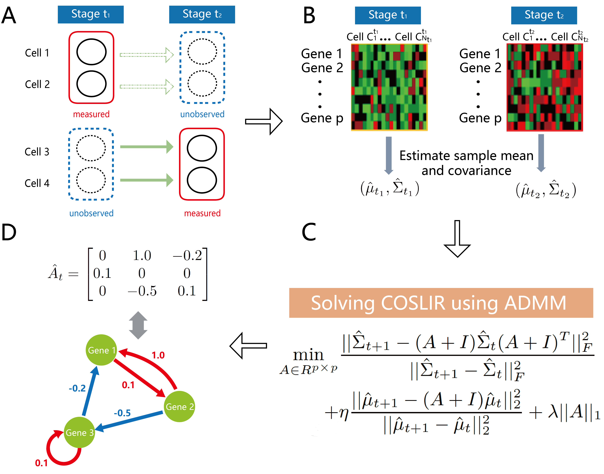

# COSLIR: Direct Reconstruction of Gene Regulatory Networks underlying Cellular state  Transitions without Pseudo-time Inference

Time-stamped cross-sectional (TSCS) single-cell expression data is commonly generated, which lacks real temporal information.  Previous inference methods for gene regulatory network driving cell-state transition always utilized and are sensitive to the accuracy of pseudo-time trajectory construction. We propose a **Co**variance restricted **S**parse **Li**near **R**egression (COSLIR) method to directly reconstruct the GRN driving cell-state transition without pseudo-time inference. Though pseudo-time is not used, the performance of COSLIR is still comparable to existing methods, validated in both qPCR and RNA-seq datasets here. Thus, COSLIR is a promising approach for GRN reconstruction as well as further single-cell development and differentiation analysis.

The general workflow of COSLIR is to solve the model multiple times after bootstrapping and then make a clipping on the rescaled value and the confidence.

# Installation

Note that this is a beta version of COSLIR. Some bugs may still remain, so please use COSLIR with caution at present. We welcome any bug reports of COSLIR and any comments, suggestions regarding our manuscript. You can install this version of COSLIR after downloading/cloning this repository.

This repo is consisted of three folders: the data (both qPCR data and single-cell RNA-seq data), the MATLAB version and the python version of COSLIR. Just go to the corresponding folder for your preferred version and check the DESCRIPTION files there for the details of usage. 

COSLIR is tested on Python v3.6.4 (Windows), with the only basic requirement of Numpy (tested on v1.14). Running COSLIR through MATLAB is tested on version 9.4 (R2018a).

# Citation